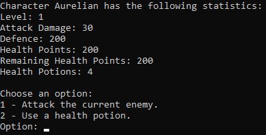
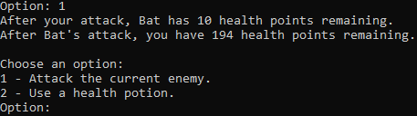
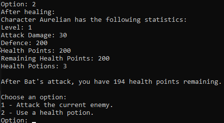
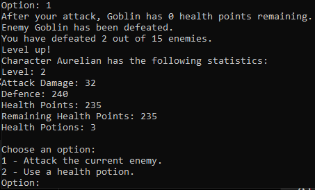
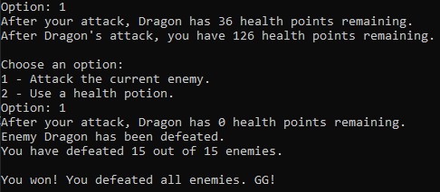

# ⚔️ RPG Game


> A `C++20 console-based RPG game` developed for a university Object-Oriented Programming course, featuring encapsulated character management, turn-based combat, health potion mechanics, level progression, operator overloading, dynamic enemy management, file-based initialization, and the Singleton design pattern.

## 📖 Overview

This project was developed as part of the **Object-Oriented Programming (OOP)** university course.

The project implements a simple **console-based RPG game** in which the player controls a character and fights a sequence of enemies. The game is played turn by turn, allowing the player to either attack the current enemy or use a health potion to restore part of their health.

The project was developed to practice and demonstrate fundamental **Object-Oriented Programming concepts in C++**, including encapsulation, constructors, getters and setters, static constants, operator overloading, dynamic memory management, and the Singleton design pattern.

The game combines character progression and combat mechanics. Characters are initialized from an input file and enemies are sorted according to their combat statistics before the battle begins. The player then fights the enemies sequentially, while the character's statistics are improved through level progression.

The main functionality includes:

- character creation and statistic management
- validated attack, defence, and health values
- turn-based combat
- enemy attack and damage calculation
- health potion usage
- character level progression
- enemy sorting
- alive and dead state management
- comparison operators
- stream insertion and extraction operators
- pre-increment and post-increment operators
- file-based character and enemy initialization
- dynamic enemy storage using `std::unique_ptr`
- Singleton-based game management
- exception handling for input file errors

A major focus of the project was applying **encapsulation and operator overloading** to keep the character logic inside the `Character` class, while the `Game` class is responsible for managing the overall game flow, enemies, player input, and win/loss conditions.

The final result is a complete **console-based RPG game** that combines the required Object-Oriented Programming concepts into a single playable application.

## 📚 Original Assignment

The project was developed as part of a university **Object-Oriented Programming (OOP)** laboratory assignment focused on implementing a simple console-based RPG game using the OOP concepts covered during the course.

The assignment requires the simulation of a turn-based RPG game in which the player fights a sequence of enemies. The player can attack the current enemy or restore part of their health using a potion. After every two defeated enemies, the character levels up and their statistics are improved.

### 1. Character Class

The `Character` class represents both the main character and the enemies.

The requirements include:

- Implementing the `name`, `lvl`, `attackDamage`, `defence`, `healthPoints`, `remainingHealthPoints`, and `healthPotionsCount` attributes.
- Implementing getters and setters for the character attributes.
- Ensuring that `attackDamage`, `defence`, and `healthPoints` remain within their required `[baseT, maxT]` intervals.
- Using the specified base and maximum values for each statistic.
- Starting each character with the required starting level and number of health potions.
- Implementing a default constructor that initializes the character using the required base values.
- Implementing a parameterized constructor receiving `name`, `attackDamage`, `healthPoints`, and `defence`.
- Using setters when initializing the character's statistics through the parameterized constructor.
- Implementing the `Heal` method, which restores health using a health potion when one is available.
- Implementing the `Attack` method using the damage calculation specified by the assignment.
- Implementing helper methods such as alive/dead state checking and level progression.
- Overloading the `>>` and `<<` operators for character input and output.
- Overloading `<`, `>`, `==`, and `!=` based on the product of the character's health, attack damage, and defence.
- Overloading pre-increment and post-increment operators for character level progression.
- Increasing the character's statistics by their corresponding base values when leveling up, while using the setters to enforce the required limits.

### 2. Game Class

The `Game` class is responsible for managing the complete game session.

The requirements include:

- Storing the main character.
- Storing the required collection of enemies using dynamic memory.
- Using the specified number of enemies (`enemiesCount = 15`).
- Implementing the `Initialize` method for loading the main character and enemies from an input file.
- Sorting the enemies in ascending order before the battle begins.
- Implementing the `Run` method for the main game loop.
- Allowing the player to choose between attacking the current enemy and using a health potion.
- Making the current enemy attack after the player's action.
- Moving to the next enemy when the current enemy is defeated.
- Increasing the main character's level after every two defeated enemies.
- Returning the turn to the player after a level-up.
- Ending the game when the player is defeated or when all enemies have been defeated.

### 3. Singleton Design Pattern

The assignment requires the game to allow the creation of only **one instance of the `Game` class**.

The implementation therefore uses the **Singleton design pattern**, with:

- A private constructor.
- A static game instance.
- A public method for accessing the single instance.
- Deleted copy constructor and copy assignment operator to prevent additional instances from being created.

Together, these requirements define the complete console-based RPG assignment and provide practice with **Object-Oriented Programming, encapsulation, operator overloading, dynamic memory management, file input, and design patterns in C++**.

## ✨ Features

- ⚔️ Turn-Based Combat
  - Attack the current enemy
  - Enemy counterattacks after each player action
  - Damage calculation based on attack damage, enemy health, and defence
  - Sequential enemy battles
  - Alive and dead state detection

- 🧪 Health Potions
  - Health potion system
  - 30 HP restoration per potion
  - Limited potion count
  - Automatic health limit enforcement
  - Potion count tracking

- 📈 Character Progression
  - Level up after every two defeated enemies
  - Attack Damage increase
  - Defence increase
  - Maximum Health increase
  - Full health restoration after leveling up
  - Automatic statistic clamping

- 👹 Enemy Management
  - Enemy loading from an input file
  - Configurable character and enemy data
  - Enemy sorting based on combat statistics
  - Sequential enemy progression
  - Configurable enemy count

- 🔄 Operator Overloading
  - Stream extraction operator `>>`
  - Stream insertion operator `<<`
  - Comparison operators `<`, `>`, `==`, and `!=`
  - Pre-increment operator `++`
  - Post-increment operator `++`

- 🧩 Object-Oriented Design
  - Encapsulated character attributes
  - Constructors and parameterized constructors
  - Getters and setters
  - Static constexpr game constants
  - Character-specific responsibilities
  - Game management separated from character logic

- 🧠 Singleton Game Manager
  - Single `Game` instance
  - Private constructor
  - Deleted copy constructor
  - Deleted copy assignment operator

- 💾 File-Based Initialization
  - Main character loaded from `input.txt`
  - Enemy data loaded from `input.txt`
  - Character and enemy statistics configurable without changing the game logic

- 🧹 Modern C++ Memory Management
  - Dynamic enemy collection using `std::unique_ptr`
  - `std::make_unique`
  - Automatic resource management through RAII
  - No manual array deallocation

- 🛡️ Error Handling
  - Input file validation
  - Standard exception handling
  - Runtime error reporting

- 🎮 Console Interface
  - Interactive command-based gameplay
  - Combat status feedback
  - Character statistic display
  - Level-up notifications
  - Victory and defeat conditions

## 🏗️ Application Architecture

The application follows a simple object-oriented architecture with responsibilities separated between the `Character` and `Game` classes.

The `Character` class encapsulates all character-related data and behavior, including statistics, combat, healing, level progression, state checking, and operator overloading.

The `Game` class manages the overall game session, including input initialization, enemy management, enemy sorting, player interaction, combat flow, level progression, and win/loss conditions.

The `Game` class is implemented using the **Singleton design pattern**, ensuring that only one game instance can exist during program execution.

```text
                              main.cpp
                                 │
                                 ▼
                          Game::getGame()
                                 │
                                 ▼
                              Game
                    ┌────────────┼────────────┐
                    │            │            │
                    ▼            ▼            ▼
              Main Character   Enemies      Game Flow
                    │            │            │
                    │            ▼            ▼
                    │   std::unique_ptr   Player Input
                    │    <Character[]>    Combat
                    │            │         Level Up
                    │            │         Win / Loss
                    │            │
                    └────────────┴────────────┐
                                             ▼
                                        Character
                                             │
                  ┌──────────────────────────┼──────────────────────────┐
                  │                          │                          │
                  ▼                          ▼                          ▼
                Stats                    Combat                   Progression
                  │                          │                          │
            Getters / Setters          Attack / Heal                Level Up
            Validation                 Alive / Dead                ++ operators
```

### 🧩 Main Components

- **`Character`**
  - Represents the main character and enemies.
  - Manages character statistics and character-specific behavior.

- **`Game`**
  - Manages the game session.
  - Handles the enemy collection, initialization, sorting, player input, combat flow, and game state.

- **`main.cpp`**
  - Application entry point.
  - Obtains the Singleton `Game` instance.
  - Initializes and runs the game.
  - Handles exceptions.

- **`Data/input.txt`**
  - External input file containing the main character and enemy data.

### ⚔️ Character Responsibilities

The `Character` class is responsible for:

- **Statistics Management**
  - Attack Damage
  - Defence
  - Health Points
  - Remaining Health Points
  - Level
  - Health Potions

- **Validation**
  - Enforcing minimum and maximum statistic values through setters.

- **Combat**
  - Attacking enemies.
  - Using health potions.
  - Checking whether a character is alive or dead.

- **Progression**
  - Leveling up.
  - Increasing character statistics.
  - Supporting pre-increment and post-increment operators.

- **Operators**
  - Character comparison operators.
  - Stream insertion and extraction operators.

### 🎮 Game Responsibilities

The `Game` class is responsible for:

- **Initialization**
  - Loading the main character and enemies from the input file.

- **Enemy Management**
  - Dynamically storing the enemies.
  - Sorting enemies before combat.

- **Game Loop**
  - Processing player actions.
  - Managing enemy attacks.
  - Moving between enemies.

- **Progression**
  - Tracking defeated enemies.
  - Triggering level-ups after every two defeated enemies.

- **Game State**
  - Detecting victory.
  - Detecting defeat.
  - Ending the game accordingly.

This separation keeps **character-specific logic inside `Character`**, while **`Game` coordinates the overall gameplay and manages the game state**.

## 📂 Project Structure

```text
RPGGame/
├── .gitignore
├── RPGGame.slnx
│
├── Images/
│   ├── 01-game-start.png
│   ├── 02-game-attack.png
│   ├── 03-game-heal.png
│   ├── 04-game-level-up.png
│   └── 05-game-victory.png
│
└── RPGGame/
    ├── RPGGame.vcxproj
    ├── RPGGame.vcxproj.filters
    ├── main.cpp
    │
    ├── Character/
    │   ├── Character.cpp
    │   └── Character.h
    │
    ├── Data/
    │   └── input.txt
    │
    └── Game/
        ├── Game.cpp
        └── Game.h
```

> Build artifacts, Visual Studio intermediate files, executables, debug databases, and other temporary files are excluded from version control through `.gitignore`.

## 🛠️ Built With

- **C++20** (ISO C++20)
- **Visual Studio 2026**
- **Microsoft C++ Build Tools v145**
- **64-bit build**
- **Standard Template Library (STL)**
- **Object-Oriented Programming (OOP)**
- **`std::unique_ptr`** for dynamic memory management
- **Singleton Design Pattern**
- **File Streams** for input data
- **Exception Handling**

## ⭐ Highlights

- ⚔️ Turn-Based RPG
  - Console-based combat system
  - Player attacks and enemy counterattacks
  - Health potion mechanics
  - Victory and defeat conditions

- 📈 Character Progression
  - Level progression after defeated enemies
  - Automatic statistic improvements
  - Health restoration on level-up
  - Statistic limits enforced through setters

- 🧩 Object-Oriented Design
  - Encapsulated `Character` and `Game` classes
  - Constructors and parameterized constructors
  - Getters and setters
  - Clearly separated class responsibilities

- 🔄 Operator Overloading
  - Stream insertion and extraction
  - Character comparison operators
  - Pre-increment and post-increment
  - Operators integrated into game logic

- 🧠 Singleton Game Manager
  - Single `Game` instance
  - Private constructor
  - Copy prevention through deleted operations

- 💾 File-Based Configuration
  - Character and enemy data loaded from an external file
  - Customizable character names and statistics
  - Configurable enemy collection

- 🧹 Modern C++ Memory Management
  - Dynamic enemy storage using `std::unique_ptr`
  - `std::make_unique`
  - Automatic resource management through RAII

- 🛡️ Robustness
  - Character statistic validation
  - Health boundary enforcement
  - Input file validation
  - Exception handling

- 🏗️ Refactored Implementation
  - Clear separation between game logic and character logic
  - Improved memory management
  - Cleaner class interfaces
  - Maintainable and extensible project structure

## 🎯 Concepts Demonstrated

- **Object-Oriented Programming (OOP)**  
  The project is structured around classes with clearly defined responsibilities, primarily `Character` and `Game`.

- **Encapsulation**  
  Character attributes are kept private and accessed or modified through public getters and setters.

- **Constructors**  
  The `Character` class provides both a default constructor and a parameterized constructor for initializing character data.

- **Data Validation**  
  Setters enforce the required minimum and maximum values for attack damage, defence, and health points.

- **Static Constants**  
  Game rules and character limits are defined using `static constexpr` constants, including base statistics, maximum values, starting level, potion count, and healing effect.

- **Operator Overloading**  
  The project demonstrates:
  - Stream insertion and extraction operators (`<<`, `>>`)
  - Comparison operators (`<`, `>`, `==`, `!=`)
  - Pre-increment and post-increment operators (`++`)

- **Character Comparison**  
  Character comparison is performed using the product of health points, attack damage, and defence, as required by the assignment.

- **Operator-Based Level Progression**  
  The overloaded increment operators are used to trigger character level progression and update the corresponding statistics.

- **Dynamic Memory Management**  
  The enemy collection is dynamically allocated and managed using `std::unique_ptr`, providing automatic resource management.

- **RAII and Smart Pointers**  
  `std::unique_ptr` and `std::make_unique` are used to manage the lifetime of the dynamically allocated enemy collection without manual deallocation.

- **Singleton Design Pattern**  
  The `Game` class implements the Singleton pattern to ensure that only one game instance can exist.

- **STL Algorithms**  
  `std::sort` is used to sort the enemies according to their overloaded comparison operator.

- **File I/O**  
  Character and enemy data are loaded from an external text file using `std::ifstream`.

- **Stream-Based Object I/O**  
  The overloaded `>>` and `<<` operators provide a clean interface for reading and displaying `Character` objects.

- **Exception Handling**  
  File initialization errors are handled using standard C++ exceptions and propagated to `main()`.

- **Separation of Responsibilities**  
  Character-specific behavior is implemented inside `Character`, while `Game` coordinates initialization, combat, player input, enemy management, and game state.

- **Turn-Based Game Logic**  
  The project demonstrates state-driven gameplay through player actions, enemy responses, character progression, and victory or defeat conditions.

- **Input-Driven Configuration**  
  Character names and statistics are loaded from an external input file, allowing the game data to be modified without changing the core game logic.

## 📷 Screenshots

The following screenshots showcase the main gameplay mechanics and progression of the console-based RPG game.

---

### 1. Game Start

The game starts by loading the main character and enemy data from the input file and displaying the character's initial statistics.



---

### 2. Combat

The player can attack the current enemy. After the player's action, the enemy counterattacks and the remaining health of both characters is updated.



---

### 3. Health Potion

The player can use a health potion to restore part of their health. The remaining number of available potions is also displayed.



---

### 4. Level Up

After the required number of defeated enemies, the main character levels up and their combat statistics are increased.



---

### 5. Victory

After all required enemies have been defeated, the game reaches the victory state.



## 📋 Requirements

- Windows 10 / Windows 11
- Visual Studio 2026
- Microsoft C++ Build Tools v145
- C++20 (ISO C++20)
- 64-bit build environment

> Developed and tested using Visual Studio 2026 with the Microsoft C++ Build Tools v145 toolset, C++20, and a 64-bit build configuration.

## 🚀 Running

1. Clone the repository.

```bash
git clone <repository-url>
```

2. Open `RPGGame.slnx` in `Visual Studio 2026`.

3. Make sure the project is configured with:

- `Microsoft C++ Build Tools v145`
- `C++20 (ISO C++20)`
- `64-bit`

4. Build the solution.

```text
Build → Build Solution
```

or simply press:

```text
Ctrl + Shift + B
```

5. Run the application.

```text
F5
```

or click **Start** in Visual Studio.

### 🎮 Gameplay

When the application starts, the game loads the main character and enemy data from:

```text
RPGGame/Data/input.txt
```

The enemies are sorted according to their combat statistics before the game begins.

The player is then presented with two possible actions:

```text
Choose an option:
1 - Attack the current enemy.
2 - Use a health potion.
Option:
```

### ⚔️ Attack

Selecting **`1`** causes the main character to attack the current enemy.

The damage dealt is calculated according to the character's attack damage and the enemy's health and defence.

If the enemy survives, it immediately attacks the main character.

When an enemy's remaining health reaches zero, the enemy is defeated and the game moves to the next enemy.

### 🧪 Health Potion

Selecting **`2`** uses a health potion if one is available.

Each potion restores **30 health points**, without exceeding the character's maximum health.

The potion count is decreased after the potion is used.

The current enemy then attacks the main character.

### 📈 Level Up

The main character levels up after every **two defeated enemies**.

Each level increases the character's statistics using the corresponding base values:

| Statistic | Increase |
|---|---:|
| **Attack Damage** | +2 |
| **Defence** | +40 |
| **Health Points** | +35 |

The statistics are automatically limited by their predefined maximum values.

After leveling up, the character's remaining health is restored to the new maximum.

### 👹 Enemy Progression

Enemies are loaded from the input file and sorted before the game starts.

The number of enemies used by the game is controlled by the **`enemiesCount`** constant in the `Game` class.

The provided input file contains the character and enemy data used for the example gameplay shown in the screenshots.

Character and enemy names and statistics can be modified directly in:

```text
Data/input.txt
```

without changing the game logic.

### 🏆 Victory

The game ends with a victory when all configured enemies have been defeated.

```text
You won! You defeated all enemies. GG!
```

### 💀 Defeat

The game ends with a defeat if the main character's remaining health reaches zero before all enemies are defeated.

```text
You lost. Game over.
```

### 📄 Input File Format

The input file uses the following format:

```text
Name AttackDamage HealthPoints Defence
```

The first line represents the main character, followed by the enemy characters.

For example:

```text
Aurelian 30 200 200
Goblin 8 50 45
Imp 10 60 55
Bat 6 40 40
```

The character and enemy statistics are processed through the `Character` setters, ensuring that the required minimum and maximum values are respected.

## 📄 License

This project is released under the **MIT License**.

See the [LICENSE](LICENSE) file for more details.
